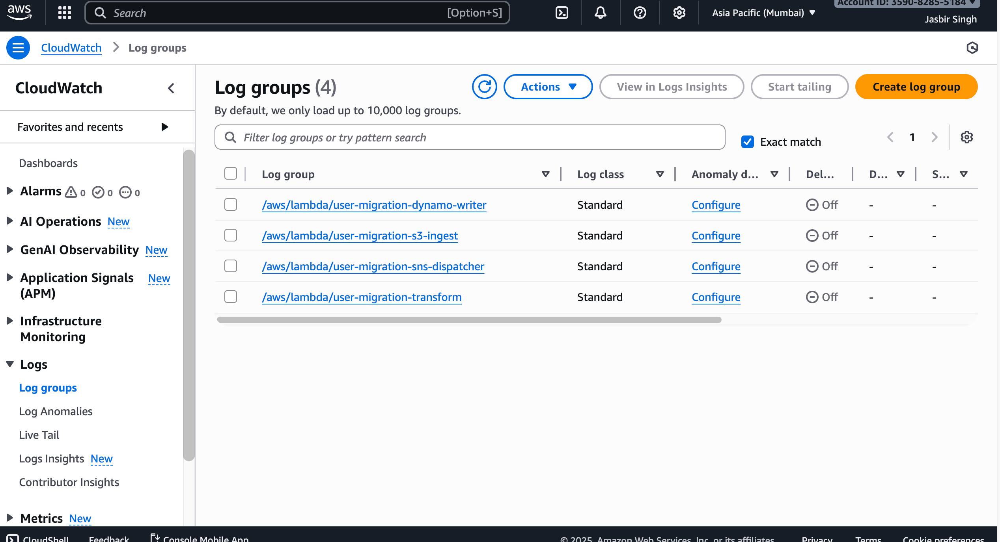

# Spring Boot AWS Lambda User Migration

Serverless reference implementation that ingests CSV uploads, transforms the data, writes it to DynamoDB, and pushes downstream notifications. The project now comprises four Spring Cloud Function Lambdas plus a lightweight file upload UI/service and Terraform-based infrastructure that all run locally against LocalStack/AWS.

## 🧭 End-to-end Flow

```
Operator uploads CSV via file-upload-service (REST/SWAGGER UI)
│
▼
S3 bucket (user-migration-input-bucket-<suffix>)
│  └─ S3:ObjectCreated triggers Lambda #1 (S3 Ingest)
▼
Lambda #1 (lambda-s3-ingest)
│  └─ Reads file via S3 SDK -> publishes each record to SNS topic ingest_to_transform
▼
Lambda #2 (lambda-transform)
│  └─ Transforms/validates payload -> publishes to topic transform_to_dynamo
▼
Lambda #3 (lambda-dynamo-writer)
│  └─ Persists records into DynamoDB table user_migration_record
│     Streams enabled for change notifications
▼
Lambda #4 (lambda-sns-dispatcher)
   └─ Reacts to DynamoDB stream events for fan-out / audit / alerts
```

## 📁 Project Layout

```
springboot-sqs-sns-lambda/
├── file-upload-service/          # Spring Boot UI + REST uploader for CSV/JSON → S3
├── lambda-s3-ingest/             # Lambda #1 – reads S3 objects, emits SNS events
├── lambda-transform/             # Lambda #2 – shape validation + normalization
├── lambda-dynamo-writer/         # Lambda #3 – writes to DynamoDB
├── lambda-sns-dispatcher/        # Lambda #4 – consumes DynamoDB streams
├── infra-terraform/              # Terraform IaC for S3, SNS, Lambda, DynamoDB, IAM
├── lambda_events/                # Sample payloads for manual lambda invoke
├── upload/                       # Sample CSV inputs
├── docker-compose.yml            # LocalStack runtime
├── deploy.sh                     # Build + terraform apply convenience script
└── pom.xml                       # Parent multi-module POM
```

## ✨ Highlights

- Fully event-driven pipeline based on SNS fan-out (no hand-written polling/SQS consumers).
- Spring Boot 3.5.7 + Java 21 across all modules with Spring Cloud Function adapters.
- LocalStack-first workflow (Docker compose) with Terraform-managed AWS resources.
- File upload service supplies REST + Swagger UI for testing without AWS Console.
- Terraform keeps jar paths configurable (`jar_lambda-*` vars) for iterative development.
- Resilient Dynamo writer (per-record error handling, null filtering, logging).
- Single `.env` for AWS_REGION/AWS creds plus LocalStack endpoints baked into configs.

## 🧰 Tech Stack

| Layer                 | Technology                                      |
|-----------------------|-------------------------------------------------|
| Runtime               | Java 21, Spring Boot 3.5.7                      |
| Cloud integration     | Spring Cloud AWS 3.4.0, AWS SDK v2              |
| Infrastructure        | Terraform + LocalStack + Docker Compose         |
| Storage/Events        | S3, SNS, DynamoDB Streams (all via LocalStack)  |

## ✅ Prerequisites

- Java 21
- Maven 3.9+
- Docker / Docker Compose
- Terraform CLI + `tflocal` wrapper (install via `pip install terraform-local`)
- AWS CLI or `awslocal` (optional but handy)

## 🚀 Getting Started

1. **Clone & enter**
   ```bash
   git clone <repo>
   cd springboot-sqs-sns-lambda
   ```

2. **Start LocalStack**
   ```bash
   docker-compose up -d
   ```

3. **Build all modules**
   ```bash
   mvn clean package
   ```
   Lambda jars will be produced in every `target/` directory, e.g.
   ```
   lambda-s3-ingest/target/lambda-s3-ingest-java21-aws.jar
   lambda-transform/target/lambda-transform-java21-aws.jar
   lambda-dynamo-writer/target/lambda-dynamo-writer-java21-aws.jar
   lambda-sns-dispatcher/target/lambda-sns-dispatcher-java21-aws.jar
   ```

4. **Provision infrastructure**
   ```bash
   cd infra-terraform
   tflocal init
   tflocal apply -var-file="terraform.tfvars" -auto-approve
   ```
   _Shortcut:_ Run `./deploy.sh` from repo root to execute Maven build + Terraform apply in one go.

5. **Launch the uploader (optional)**
   ```bash
   mvn spring-boot:run -pl file-upload-service
   ```
   Swagger UI: `http://localhost:9081/swagger-ui/index.html`

## ⚙️ Configuration

### Terraform variables (`infra-terraform/terraform.tfvars`)

```hcl
jar_lambda-s3-ingest      = "../lambda-s3-ingest/target/lambda-s3-ingest-java21-aws.jar"
jar_lambda-transform      = "../lambda-transform/target/lambda-transform-java21-aws.jar"
jar_lambda-dynamo-writer  = "../lambda-dynamo-writer/target/lambda-dynamo-writer-java21-aws.jar"
jar_lambda-sns-dispatcher = "../lambda-sns-dispatcher/target/lambda-sns-dispatcher-java21-aws.jar"
aws_region                = "eu-west-1"
```

### Application properties

Each module carries its own `application.properties`/`application.yml`:

- `file-upload-service`: bucket name, LocalStack S3 endpoint, region.
- `lambda-s3-ingest`: SNS endpoint override, tracing log levels.
- `lambda-transform`: Destination topic ARN + object mapping config.
- `lambda-dynamo-writer`: DynamoDB template wiring and SNS endpoint.
- `lambda-sns-dispatcher`: DynamoDB stream fan-out + SNS destination.

> LocalStack endpoints already baked in (e.g., `http://localhost.localstack.cloud:4566`). Adjust when deploying to AWS by swapping endpoint properties / `.env`.

## 🧪 Testing the pipeline

1. **Upload sample CSV** (via REST)
   ```bash
   curl -F file=@upload/uploaded-test.csv localhost:9081/api/files/upload
   ```
   or use Swagger UI.

2. **Trigger ingest lambda manually**
   ```bash
   awslocal lambda invoke \
     --function-name user-migration-s3-ingest \
     --payload file://infra-terraform/event.json \
     out.json
   ```

3. **Inspect DynamoDB**
   ```bash
   awslocal dynamodb scan --table-name user_migration_record
   ```

4. **Tail logs**
   ```bash
   awslocal logs tail /aws/lambda/user-migration-transform --follow
   ```

## 📦 Lambda Responsibilities

| Module                 | Handler                              | Responsibilities |
|-----------------------|---------------------------------------|------------------|
| `lambda-s3-ingest`    | `com.singh.dispatcher.handler.S3IngestHandler` | Streams S3 objects, parses CSV/JSON, emits user record batches to SNS |
| `lambda-transform`    | `com.singh.transform.handler.TransformHandler` | Validates payloads, enriches/norms schema, forwards to next topic |
| `lambda-dynamo-writer`| `com.singh.transform.handler.DynamoWriterHandler` | Writes sanitized records to DynamoDB, logs per-record success/failure |
| `lambda-sns-dispatcher`| `com.singh.dispatcher.handler.SnsDispatcherHandler` | Consumes DynamoDB stream events for downstream alerts/fan-out |

### Shared DTO

```java
@DynamoDbBean
public class UserMigrationRecord {
    @DynamoDbPartitionKey
    public String getId() { return id; }
    // name + email getters/setters omitted for brevity
}
```

## 🧹 Cleanup

```bash
cd infra-terraform
tflocal destroy -var-file="terraform.tfvars" -auto-approve
docker-compose down
mvn clean
```

## 🐞 Troubleshooting

- **Lambda not found** → ensure `mvn clean package` ran and Terraform pointed at the generated jar paths.
- **LocalStack connection errors** → restart via `docker-compose down && docker-compose up -d`.
- **Empty SNS destination** → update `aws.sns.destination` in the respective module’s `application.properties`.
- **Missing DynamoDB records** → tail `lambda-dynamo-writer` logs; handler now logs success/failure counts per batch.

## 📚 References

- [Spring Cloud Function AWS Adapter](https://spring.io/projects/spring-cloud-function)
- [LocalStack Docs](https://docs.localstack.cloud/)
- [Terraform AWS Provider](https://registry.terraform.io/providers/hashicorp/aws/latest/docs)

---



Maintained by **Jasbir Singh**. Contributions welcome—open an issue or PR with improvements. 
